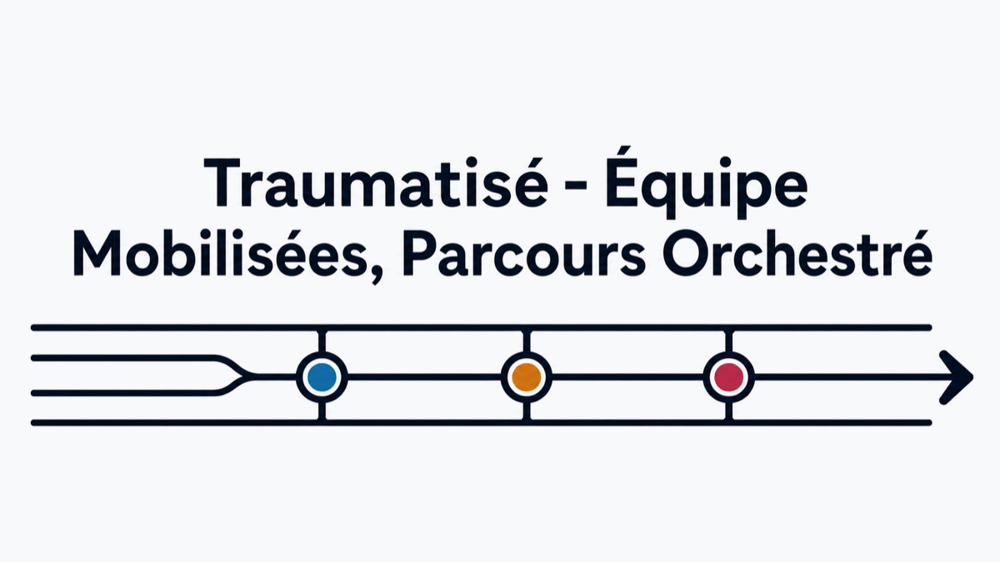

# TEMPO — partition d'urgence

<p align="center">
  
</p>

**Projet open source** ([licence MIT](LICENSE)). Application cliquable : le parcours d'un
**traumatisé sévère** visualisé comme une **partition à 3 pistes** sur une **timeline
temporelle commune**, façon Songsterr.

- **Régulation** (SAMU / Centre 15)
- **Pré-hospitalier** (SMUR / VSAV)
- **Intra-hospitalier** (SAUV / déchocage, réa, bloc)

Une action renseignée par une équipe devient visible des autres pistes et **débloque /
fait clignoter** des actions ailleurs (ex. FAST+ et instable → l'onglet BLOC clignote sur la
régul et l'intra-hosp ; score ABC ≥ 2 → transfusion massive ; grade → niveau de trauma center).

> ⚠️ Démonstration à **données fictives**. Aucun champ patient. Le contenu clinique
> (actions, seuils, mappings) est à **valider** par le médecin référent — voir
> [docs/PROPOSITIONS-CLINIQUES.md](docs/PROPOSITIONS-CLINIQUES.md).

## 🌐 Démo en ligne

**https://mediglotte.github.io/TEMPO/**

Chaque merge sur `main` est **déployé automatiquement** sur GitHub Pages
(workflow [`deploy.yml`](.github/workflows/deploy.yml)). Détails et runbook :
[docs/DEPLOYMENT.md](docs/DEPLOYMENT.md).

## Démarrer (développement)

```bash
npm install
npm run dev        # http://localhost:5173
```

À l'ouverture, **choix du rôle** (Régulateur / SMUR-VSAV / Hôpital / Observateur) : on **édite
seulement sa ligne** et on **lit** les deux autres (modifiable à tout moment via « Je suis… »).
Un **chrono géant** démarre à l'ouverture et n'est **arrêtable que par l'équipe Hôpital**.

Dans l'app :
- **« Démo guidée (pas à pas) »** : rejoue le cas action par action (on « voit » chaque clic et
  les cascades se déclencher) — lecture / pause / vitesse 0,5–2× / recommencer. Idéal en présentation.
- **« Scénario démo »** : charge instantanément le même cas (instable, grade A) entièrement pré-rempli.
- **« Copier le lien »** / **« WhatsApp »** : partage un **instantané** de l'état via une URL (sans
  backend).
- **« Exporter PDF »** : télécharge un récap chronologique horodaté des actions réalisées.
- **« Tout réduire »** : condense chaque piste en une rangée de **mini-icônes** (détail au survol).
- **« 2ᵉ fenêtre »** : ouvre une fenêtre synchronisée en temps réel (même machine).
- **Dictée vocale** : renseigne les constantes à la voix (navigateurs compatibles).

Le **score de Vittel** est une checklist structurée (5 catégories dont la cinétique) ouverte via
l'icône ⓘ de sa pastille ; ≥ 1 critère coché → « traumatisé sévère » (met en avant le grade).

## Synchro « salle commune » (plusieurs machines)

Trois niveaux de partage, du plus simple au plus complet :

1. **Lien instantané** (`Copier le lien`) : fige l'état dans l'URL — le destinataire voit une
   photo du cas, sans synchro live.
2. **« 2ᵉ fenêtre »** : synchro temps réel entre fenêtres du **même navigateur / même machine**
   (`BroadcastChannel`, sans serveur). Idéal pour une démo « côte à côte ».
3. **Salon partagé** (bouton de synchro) : plusieurs **machines différentes** (salle commune)
   voient et éditent le **même cas en direct**, via un petit serveur de salons. Les salons sont
   éphémères (12 h), sans compte ni donnée durable. Mise en place du serveur :
   [docs/DEPLOYMENT.md](docs/DEPLOYMENT.md).

## Faire tester par quelqu'un (hors-ligne / e-mail)

Génère un **fichier HTML unique, autonome**, à envoyer par e-mail / Drive / WhatsApp :

```bash
npm run build:single
```

→ produit **`partition-urgence.html`** à la racine. La personne le **double-clique** : l'app
s'ouvre dans son navigateur, sans rien installer, hors-ligne, sur n'importe quel réseau.
Chaque destinataire a sa propre session (pas de synchro live entre machines).

## Scripts

```bash
npm run build              # build statique (dossier dist/) — celui que déploie GitHub Pages
npm run build:single       # → partition-urgence.html (fichier unique autonome, à envoyer)
npm test                   # tests unitaires (moteur de règles + partage par lien)
```

## Architecture (data-driven)

Le contenu clinique est **séparé du code** : on fait évoluer la filière sans toucher au moteur.

```
src/
  types/model.ts                       modèle (actions, règles, conditions, effets, état)
  config/protocols/polytrauma/         ← CONTENU éditable (tracks, actions, rules, clinical…)
  engine/                              moteur pur : evaluate(rules, état) → effets visuels
  store/                               état du cas (Zustand) + sélecteurs dérivés
  share/                               partage par lien (lz-string) + localStorage
  sync/                                salons multi-machines (fusion LWW, polling HTTP)
  voice/                               dictée vocale (reconnaissance + parsing français)
  components/                          UI « Songsterr » (timeline + 3 pistes + détails)
```

Ajouter un déclencheur = ajouter un objet dans `config/protocols/polytrauma/rules.ts`.
Ajouter une action = un objet dans `actions.ts`. Le validateur (`config/validate.ts`)
signale en dev toute cible orpheline.

## Licence

[MIT](LICENSE) — © 2026 Félix Amiot & Pierre Balaz.
